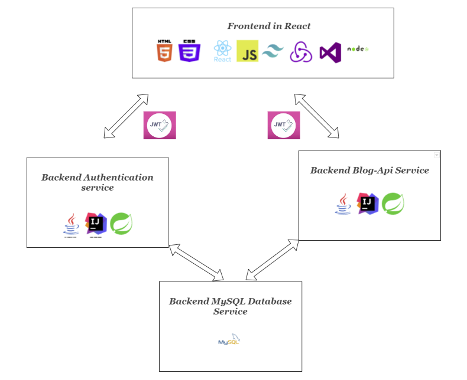

<h1 align="center">Welcome to my fullstack application using microservices!</h1>

<h4 align="center">ⓘ This gives an overview on how to understand the application and where to find each microservice</h4>

<h3>Map overview: </h3>

# Fullstack-Application
This contains the information about my technical report from Nackademin. 
