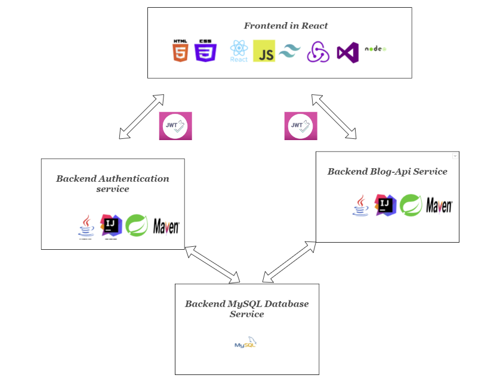

<h1 align="center">Welcome to my fullstack application using microservices!</h1>

<h4 align="center">ⓘ This gives an overview on how to understand the application and where to find each microservice</h4>

<h2 align="center" style="font-style: italic" >Map Project Overview: </h2>

<h2 align="center" > </a>
<h2 align="center" style="font-style: italic"> Orchistrated with Docker  </h2>

The main idea of the program was to illustrate how to assamble a fullstack solution using microservices. There is a simple frontend built in React using some popular libraries(Redux, ReactRouter, tailwind) The frontend can register a new user, login a user, and read and write blog entries from the loged in user.

The frontend is connected to my Spring Application(AuthenticationService) which only handles two things, create a user and login a user so that the user may use other services presented on the frontend(BlogApiService).

For validation and authentication of a user im using JsonWebTokens signed with RSA keys, the userpassword is of course not stored in MySQL database(following GDPR guidelines), but only the hashed version of it using BCrypt for encoding and decoding.

⭐Example of docker-compose file👉 <a href="https://github.com/Toms-Organization/Fullstack-Application/blob/main/docker-compose.yml" target="_blank" rel="noreferrer"> Find Project here</a>

<h2>Microservices Repository</h2>

⭐Frontend Service - React 👉 <a href="https://github.com/Toms-Organization/fullstack-React-frontend" target="_blank" rel="noreferrer"> Find Project here</a>

⭐Backend Service Authentication- Java, Spring Boot 👉 <a href="https://github.com/Toms-Organization/fullstack-authserver-backend" target="_blank" rel="noreferrer"> Find Project here</a>

⭐Backend Service BlogAPI - Java Spring Boot  👉 <a href="https://github.com/Toms-Organization/fullstack-blogapi-backend" target="_blank" rel="noreferrer">  Find Project here</a> 

